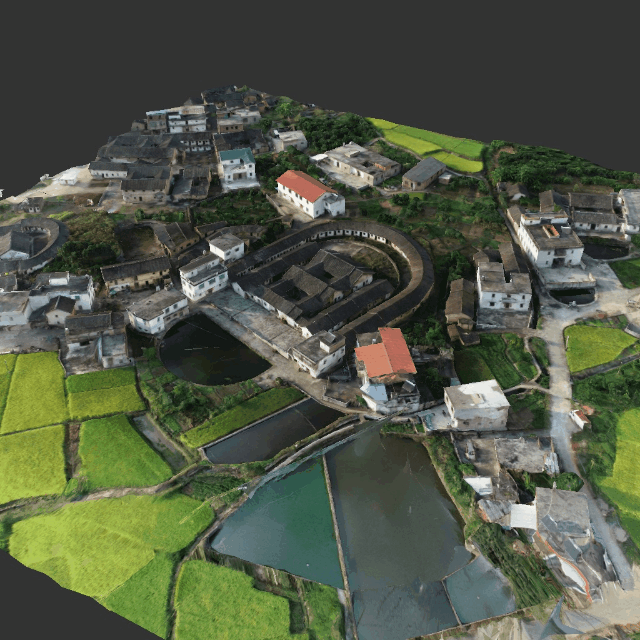
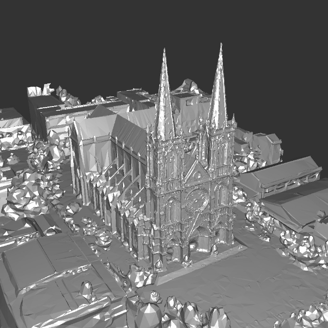
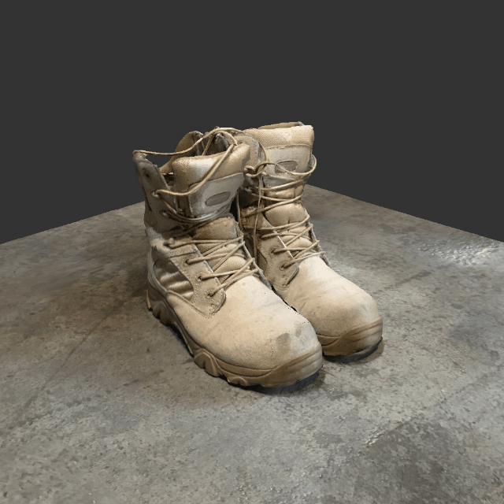

# BlendedMVS


## Important Update on Dataset Download

We created a Github release for stable download of the BlendedMVS/+/++ dataset. If you encounter problem downloading with the previews OneDrive Link, please try download the dataset as the release artifacts (please refer to [issue #40](https://github.com/YoYo000/BlendedMVS/issues/40))

Download BlendedMVS:
```
wget https://github.com/YoYo000/BlendedMVS/releases/download/v1.0.0/BlendedMVS.zip
```

Download BlendedMVS+
```
#!/bin/bash

# Base URL
BASE_URL="https://github.com/YoYo000/BlendedMVS/releases/download/v1.0.1"

# Download split files BlendedMVS1.z01 to BlendedMVS1.z42
for i in $(seq -w 1 42); do
    FILE="BlendedMVS1.z$i"
    echo "Downloading $FILE..."
    wget -c "${BASE_URL}/${FILE}"
done

# Download the final .zip descriptor
ZIP_FILE="BlendedMVS1.zip"
echo "Downloading $ZIP_FILE..."
wget -c "${BASE_URL}/${ZIP_FILE}"

echo "All files downloaded."
```

Download BlendedMVS++
```
#!/bin/bash

# Base URL
BASE_URL="https://github.com/YoYo000/BlendedMVS/releases/download/v1.0.2"

# Download split files BlendedMVS2.z01 to BlendedMVS2.z42
for i in $(seq -w 1 42); do
    FILE="BlendedMVS2.z$i"
    echo "Downloading $FILE..."
    wget -c "${BASE_URL}/${FILE}"
done

# Download the final .zip descriptor
ZIP_FILE="BlendedMVS2.zip"
echo "Downloading $ZIP_FILE..."
wget -c "${BASE_URL}/${ZIP_FILE}"

echo "All files downloaded."
```

## About
[BlendedMVS](https://arxiv.org/abs/1911.10127) is a large-scale MVS dataset for generalized multi-view stereo networks. The dataset contains 17k MVS training samples covering a variety of 113 scenes, including architectures, sculptures and small objects. 

<a href="https://www.altizure.com/project-model?pid=5bfe5ae0fe0ea555e6a969ca"></a> <a href="https://www.altizure.com/project-model?pid=58eaf1513353456af3a1682a"></a>

<a href="https://www.altizure.com/project-model?pid=5c34529873a8df509ae57b58"></a> <a href="https://www.altizure.com/project-model?pid=57f8d9bbe73f6760f10e916a"></a>

## Upgrade to BlendedMVG
BlendedMVG, a superset of [BlendedMVS](https://arxiv.org/abs/1911.10127), is a multi-purpose large-scale dataset for solving multi-view geometry related problems. Except for the 113 scenes in BlendedMVS dataset, we follow its blending procedure to generate 389 more scenes (originally shown in [GL3D](https://github.com/lzx551402/GL3D)) for BlendedMVG. The training image number is increased from 17k to over 110k.

BlendedMVG and its preceding works ([BlendedMVS](https://arxiv.org/abs/1911.10127) and [GL3D](https://github.com/lzx551402/GL3D)) have been applied to several key 3D computer vision tasks, including image retrieval, image feature detection and description, two-view outlier rejection and multi-view stereo. If you find BlendedMVS or BlendedMVG useful for your research, please cite: 

```
@article{yao2020blendedmvs,
  title={BlendedMVS: A Large-scale Dataset for Generalized Multi-view Stereo Networks},
  author={Yao, Yao and Luo, Zixin and Li, Shiwei and Zhang, Jingyang and Ren, Yufan and Zhou, Lei and Fang, Tian and Quan, Long},
  journal={Computer Vision and Pattern Recognition (CVPR)},
  year={2020}
}
```

## License

<a rel="license" href="http://creativecommons.org/licenses/by/4.0/"></a><br /><span xmlns:dct="http://purl.org/dc/terms/" href="http://purl.org/dc/dcmitype/Dataset" property="dct:title" rel="dct:type">BlendedMVS and BlendedMVG</span> are licensed under a <a rel="license" href="http://creativecommons.org/licenses/by/4.0/">Creative Commons Attribution 4.0 International License</a>!!!


## Download

For MVS networks, BlendedMVG is preprocessed and split into 3 smaller subsets (BlendedMVS, BlendedMVS+ and BlendedMVS++):

|Dataset         | Resolution (768 x 576) | Resolution (2048 x 1536) | Supplementaries | 
|:--------------:|:---------------:|:----------------------------------:|:---------------:|
|BlendedMVS      |      [low-res set](https://1drv.ms/u/s!Ag8Dbz2Aqc81gVDu7FHfbPZwqhIy?e=BHY07t) (27.5 GB)    | [high-res set](https://1drv.ms/u/s!Ag8Dbz2Aqc81ezb9OciQ4zKwJ_w?e=afFOTi) (156 GB)    | [textured meshes](https://1drv.ms/u/s!Ag8Dbz2Aqc81fkvi2X9Mmzan0FI?e=7x2WoS) (9.42 GB), [other images](https://1drv.ms/u/s!Ag8Dbz2Aqc81gVMgQoHpAJP4jlwo?e=wVOWqD) (7.56 GB) |
|BlendedMVS+|[low-res set](https://1drv.ms/u/s!Ag8Dbz2Aqc81gVLILxpohZLEYiIa?e=MhwYSR) (81.5 GB)        | -    |   - |
|BlendedMVS++|[low-res set](https://1drv.ms/u/s!Ag8Dbz2Aqc81gVHCxmURGz0UBGns?e=Tnw2KY) (80.0 GB)  | -   |   -    |

Experiments in [BlendedMVS paper](https://arxiv.org/abs/1911.10127) were conducting using the BlendedMVS low-res-dataset. In most cases, the low-res dataset would be enough. 

## Dataset Structure

BlendedMVS(G) dataset adopts MVSNet input format. Please structure your dataset as listed below after downloading the whole dataset:
 
```
DATA_ROOT                 
├── BlendedMVG_list.txt                
├── BlendedMVS_list.txt                 
├── BlendedMVS+_list.txt                
├── BlendedMVS++_list.txt              
├── ...
├── PID0                        
│   ├── blended_images          
│   │	├── 00000000.jpg        
│   │	├── 00000000_masked.jpg        
│   │	├── 00000001.jpg        
│   │	├── 00000001_masked.jpg        
│   │	└── ...                 
│   ├── cams                      
│   │  	├── pair.txt           
│   │  	├── 00000000_cam.txt    
│   │  	├── 00000001_cam.txt    
│   │  	└── ...                 
│   └── rendered_depth_maps     
│      	├── 00000000.pfm        
│     	├── 00000001.pfm        
│     	└── ...                    
├── PID1                        
├── ...                         
└── PID501     
```

``PID`` here is the unique project ID listed in the ``BlendedMVG_list.txt`` file. We provide blended images with and without masks.  For detailed file formats, please refer to [MVSNet](https://github.com/YoYo000/MVSNet). 

## What you can do with BlendedMVS(G)?

BlendedMVS(G) could also be applied to a variety of geometry related problems, including, but not limited to:

* Multi-view/Two-view stereo ([MVSNet & R-MVSNet](https://github.com/YoYo000/MVSNet))
* Descriptors & Detectors & Matching ([GL3D](https://github.com/lzx551402/GL3D) & [ASLFeat](https://github.com/lzx551402/ASLFeat) & [ContextDesc](https://github.com/lzx551402/contextdesc) & [GeoDesc](https://github.com/lzx551402/geodesc) & [OANet](https://github.com/zjhthu/OANet))
* Multi-view/Single-view camera pose estimation
* Novel View Synthesis (Evaluation of NeRF and 3DGS related works)
* Single-view depth/normal estimation ([Depth Anything](https://arxiv.org/pdf/2406.09414) & [Depth Pro](https://arxiv.org/pdf/2410.02073))
* Transformer-based 3D Vision ([DUSt3R](https://arxiv.org/pdf/2312.14132) & [VGGT](https://vgg-t.github.io/))

Feel free to modify the dataset and adjust to your own tasks! 

## Note 

* Online augmentation should be implemented by users themselves. An example for tensorflow users could be found in [MVSNet](https://github.com/YoYo000/MVSNet). An example for pytorch users could be found in [CasMVSNet_pl](https://github.com/kwea123/CasMVSNet_pl)
* The number of selected source images for a given reference image might be smaller than 10 (when parsing pair.txt).
* The `depth_min` and `depth_max` in ground truth cameras might be smaller or equal to zero (very few, when parsing *_cam.txt).
* The rendered depth map and blended images might be empty as the textured mesh model is not necessarily to be complete (when dealing with *.pfm and *.jpg files).


## Changelog

### 2020 April 13: 
* Upgrade to BlendedMVG dataset!

### 2020 April 13: 
* Upload BlendedMVS textured mesh models
* Upload BlendedMVS high-res dataset
* Upload input and rendered images (low-res)
* Fix bug on multi-texture mesh rendering, update BlendedMVS low-res dataset.

### 2022 June 8:
* Fix download links


### 2025 Sep 8:
* Download links by Github release
* Update usages
