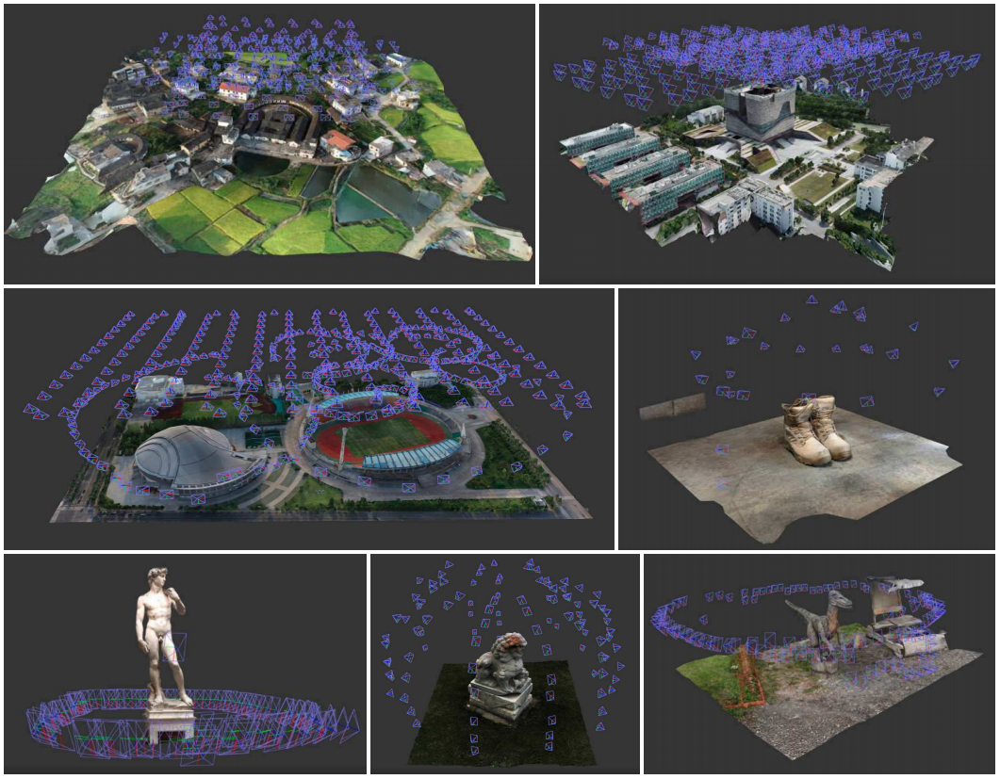

# BlendedMVS


## About the Dataset
[BlendedMVS](https://arxiv.org/abs/1911.10127) is a large-scale MVS dataset for generalized multi-view stereo networks. The dataset contains over 17k MVS training samples covering a variety of scenes, including architectures, sculptures and small objects. If you find the dataset useful for your research, please cite:
```
@article{yao2019blendedmvs,
  title={BlendedMVS: A Large-scale Dataset for Generalized Multi-view Stereo Networks},
  author={Yao, Yao and Luo, Zixin and Li, Shiwei and Zhang, Jingyang and Ren, Yufan and Zhou, Lei and Fang, Tian and Quan, Long},
  journal={arXiv:1911.10127 [cs.CV]},
  year={2019}
}
```



### usage


